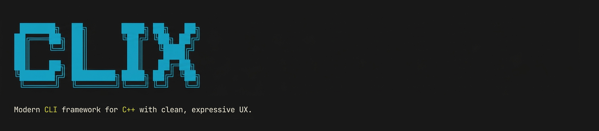

# CLIX

<p align="center">
  
</p>

<p align="center">
  <a href="https://github.com/kkokotero/clix/actions/workflows/ci.yml"></a>
  <a href="https://github.com/kkokotero/clix/releases"></a>
  <a href="./LICENSE"></a>
  <a href="https://en.cppreference.com/w/cpp/17"></a>
  <a href="https://github.com/kkokotero/clix"></a>
  <a href="./vcpkg/ports/clix"></a>
</p>

`CLIX` is a header-only C++ CLI library for building command-line applications with a fluent API, nested subcommands, typed values, validators, config files, environment-variable support, deprecation metadata, documentation export, and shell completion.

## Why CLIX Exists

`CLIX` was created to make modern C++ CLIs feel less fragmented.

Many existing libraries are strong at parsing flags, but once you also need:

- nested command trees
- readable help
- typed values
- validation
- environment-variable fallbacks
- config-backed values
- deprecation handling
- documentation export
- shell completion

you often end up stitching several ideas together by hand.

`CLIX` takes a schema-driven approach instead: define the command model once, then reuse that same metadata for parsing, validation, help output, config loading, environment resolution, deprecation warnings, completion, and generated documentation.

The project also keeps a few strong constraints on purpose:

- header-only distribution
- no external runtime dependencies
- readable C++17 API
- modular includes through `<clix/...>`
- features that stay small enough to understand

## Highlights

- Header-only package with clean `find_package(clix CONFIG REQUIRED)` integration
- No external runtime dependencies
- C++17 baseline
- Modular public includes through `<clix/...>`
- Fluent builders for arguments and options
- Optional routers for modular command registration in large projects
- Reusable command bundles through `command.use(...)`
- Nested subcommands with inherited global options
- Built-in `URL`, `Path`, `Time`, `Size`, JSON, and array value kinds
- Typed custom parsers through `parse_as<T>(...)`
- Value-source tracking through `Invocation::argument_source(...)` and `Invocation::option_source(...)`
- Deprecation metadata for commands, options, and aliases
- Schema and Markdown export from the same command model
- Validators, config files, environment variables, and shell completion driven by the same command schema
- Readable error messages with hints for invalid input

## Project Health

- [Contributing guide](./CONTRIBUTING.md)
- [Code of Conduct](./CODE_OF_CONDUCT.md)
- [Security Policy](./SECURITY.md)

## Installation

### CMake package

```cmake
find_package(clix CONFIG REQUIRED)
target_link_libraries(your_target PRIVATE clix::clix)
```

### Includes

Preferred modular includes:

```cpp
#include <clix/cli.hpp>
#include <clix/validators.hpp>
#include <clix/router.hpp>
```

Umbrella include:

```cpp
#include <clix.hpp>
```

### vcpkg

The supported vcpkg flow today is the bundled overlay port that lives inside this repository:

```bash
git clone https://github.com/kkokotero/clix
vcpkg install clix --overlay-ports=<path-to-clix>/vcpkg/ports
```

That path is lightweight, works today, and keeps the port close to the library sources. It also matches the alternative that the vcpkg maintainers recommended while `clix` is still growing toward their curated-registry maturity bar.

The port files live under `vcpkg/ports/clix`, so users can point `--overlay-ports` at this repository directly.

From there, regular CMake integration works as expected:

```cmake
find_package(clix CONFIG REQUIRED)
target_link_libraries(your_target PRIVATE clix::clix)
```

This repository still keeps the port upstream-friendly. If `clix` later meets the curated-registry maturity bar, the same port can be used as the base for another submission to `microsoft/vcpkg`.

## Quick Start

```cpp
#include <cctype>
#include <iostream>
#include <string>

#include <clix/cli.hpp>

int main(int argc, char** argv) {
    clix::CLI cli("hello", "1.0.0");
    cli.description("Small example built with CLIX.");

    auto& greet = cli.command("greet").description("Print a greeting.");
    greet.arg("name").description("Name to greet.").label("name");
    greet.opt("caps").alias("c").description("Render the greeting in uppercase.");

    greet.action([](const clix::Invocation& invocation) {
        auto message = std::string("Hello, ") + invocation.argument<std::string>("name") + "!";
        if (invocation.option<bool>("caps")) {
            for (auto& character : message) {
                character = static_cast<char>(std::toupper(static_cast<unsigned char>(character)));
            }
        }

        std::cout << message << '\n';
    });

    return cli.run(argc, argv);
}
```

## Design Model

`CLIX` is centered on a small set of runtime types:

- `clix::CLI`
  - The root command entry point.
- `clix::Command`
  - The builder used by the root and by nested subcommands.
- `clix::Invocation`
  - The immutable runtime view delivered to handlers.
- `clix::Router`
  - An optional composition layer for modular command registration.

The same declared schema drives:

- parsing
- help generation
- validation
- config loading
- environment-variable resolution
- deprecation warnings
- schema export
- Markdown export
- shell completion

## Fluent API

The builder API is intentionally small and predictable:

```cpp
create.arg("name")
    .description("Project name.")
    .label("name")
    .env("WORKSPACE_NAME")
    .validate(clix::validators::non_empty_string());

create.opt("jobs", clix::ValueKind::number)
    .alias("j")
    .description("Parallel jobs.")
    .label("count")
    .default_value(clix::CliValue(4.0))
    .validate(clix::validators::number_range(1.0, 32.0));
```

Available builder features include:

- `description(...)`
- `label(...)`
- `optional()` and `required()`
- `default_value(...)`
- `env(...)`
- `choices(...)`
- `complete(...)`
- `validate(...)`
- `alias(...)`
- `deprecated(...)`
- `deprecated_alias(...)`
- `parse_as<T>(...)`
- `group(...)`
- `requires(...)`
- `excludes(...)`
- `exclusive_group(...)`
- `hidden()`
- `use(...)`

## Supported Value Types

`CLIX` supports these logical value kinds out of the box:

| Value kind | C++ runtime type | Typical use |
| --- | --- | --- |
| `ValueKind::boolean` | `bool` | feature flags, toggles |
| `ValueKind::string` | `std::string` | free-form text |
| `ValueKind::number` | `double` | numeric parameters |
| `ValueKind::choice` | `std::string` | enumerated string values |
| `ValueKind::path` | `clix::Path` | files and directories |
| `ValueKind::url` | `clix::Url` | absolute URLs such as `https://example.com` |
| `ValueKind::time` | `clix::Time` | durations / time-like values |
| `ValueKind::size` | `clix::Size` | memory / byte-size values |
| `ValueKind::json` | `clix::JsonObject` | structured JSON payloads |
| `ValueKind::boolean_array` | `std::vector<bool>` | repeated booleans |
| `ValueKind::string_array` | `std::vector<std::string>` | repeated strings |
| `ValueKind::number_array` | `std::vector<double>` | repeated numbers |
| `ValueKind::path_array` | `std::vector<clix::Path>` | repeated paths |
| `ValueKind::url_array` | `std::vector<clix::Url>` | repeated URLs |
| `ValueKind::time_array` | `std::vector<clix::Time>` | repeated durations |
| `ValueKind::size_array` | `std::vector<clix::Size>` | repeated sizes |

Examples:

```cpp
command.opt("verbose");  // boolean
command.opt("jobs", clix::ValueKind::number);  // double
command.opt("format", clix::ValueKind::choice).choices({"json", "yaml"});
command.arg("manifest", clix::ValueKind::path);
command.arg("endpoint", clix::ValueKind::url);
command.opt("tag", clix::ValueKind::string_array);
```

## Custom Typed Parsers

When the built-in value kinds are not enough, `CLIX` can parse directly into your own runtime types.

```cpp
struct SemanticVersion {
    int major = 0;
    int minor = 0;
    int patch = 0;
};

command.arg("version")
    .parse_as<SemanticVersion>(
        [](std::string_view raw) {
            // parse "1.2.3"
            return SemanticVersion{/* ... */};
        },
        "semver",
        [](const SemanticVersion& value) {
            return std::to_string(value.major) + "." +
                   std::to_string(value.minor) + "." +
                   std::to_string(value.patch);
        });
```

Handlers can then read the typed value directly:

```cpp
auto version = invocation.argument<SemanticVersion>("version");
```

## Value Sources

Invocations track where each resolved value came from:

- command line
- config file
- environment variables
- default values

```cpp
auto version_source = invocation.argument_source("version");
auto profile_source = invocation.option_source("profile");
auto format_source = invocation.source("format");
```

This is useful for audit logs, debug output, and advanced UX.

## Nested Subcommands

Commands can be nested as deeply as needed:

```cpp
auto& project = cli.command("project").description("Project lifecycle commands.");
auto& create = project.command("create").description("Create a new project.");
auto& inspect = project.command("inspect").description("Inspect an existing project.");
```

Global options declared on parent commands are visible from child commands, even when the user places them before the subcommand:

```bash
workspace --verbose project create app
```

## Routers

`clix::Router` lets large applications register commands in modules and mount them under prefixes.

```cpp
clix::Router app_router;
app_router.use("project", make_project_router());
app_router.use("release", make_release_router());
app_router.mount(cli);
```

This keeps command registration modular while preserving the same `Command` builder API inside each module.

## Reusable Bundles

For shared option sets that do not need a full router, you can compose reusable bundles:

```cpp
auto logging_bundle = [](clix::Command& command) {
    command.opt("verbose").description("Enable verbose output.");
    command.opt("json").description("Render JSON output.");
};

cli.command("build").use(logging_bundle);
cli.command("test").use(logging_bundle);
```

This keeps large CLIs DRY without introducing another abstraction layer.

## Validators

Built-in validators include:

- `clix::validators::non_empty_string()`
- `clix::validators::number_range(min, max)`
- `clix::validators::positive_number()`
- `clix::validators::existing_path()`
- `clix::validators::matches(regex)`
- `clix::validators::length(min, max)`
- `clix::validators::all_of({...})`
- `clix::validators::any_of({...})`
- `clix::validators::none_of({...})`

Custom validators are regular callables that return `std::optional<std::string>`.

## Option Relationships

`CLIX` supports a few high-value option relationships without forcing a large DSL:

```cpp
command.opt("push").requires("token");
command.opt("dry-run").excludes("push");
command.opt("json").exclusive_group("output");
command.opt("yaml").exclusive_group("output");
```

This covers:

- required companion options
- conflicting options
- mutually exclusive sets

## Deprecations

Commands, options, and aliases can carry deprecation metadata without breaking compatibility immediately.

```cpp
auto& deploy = cli.command("deploy")
                   .deprecated("Use `release deploy` instead.")
                   .deprecated_alias("ship", "Use `deploy` instead.");

deploy.opt("token", clix::ValueKind::string)
    .deprecated("Use `api-token` instead.")
    .deprecated_alias("t", "Use `--token` instead.");
```

That metadata is reused across:

- runtime warnings
- help output
- generated schema
- generated Markdown docs

## Environment Variables

Arguments and options can read from one or more environment variables:

```cpp
command.arg("name").env("APP_NAME");
command.opt("language", clix::ValueKind::choice).env("APP_LANGUAGE");
```

This is useful when you want non-interactive defaults without giving up the command-line UX.

### Custom Environment Readers

Environment-variable lookup is parameterizable.

By default `CLIX` reads from the process environment through `std::getenv`.

You can also provide a custom reader:

```cpp
clix::CLI cli("demo");

cli.environment_reader([](std::string_view name) -> std::optional<std::string> {
    if (name == "APP_NAME") {
        return std::string("from-custom-source");
    }
    return std::nullopt;
});
```

If the custom reader does not return a value, `CLIX` still falls back to `std::getenv`.

This is useful for:

- tests
- embedded runtimes
- custom secret/config backends
- adapters that do not want to depend directly on process-global environment state

## Config Files

Enable config file loading once on the root CLI:

```cpp
clix::ConfigFileSettings config;
config.environment_variables = {"APP_CONFIG"};
config.default_filenames = {"app.toml", "app.json"};
config.allowed_extensions = {".toml", ".json"};

cli.enable_config_files(config);
```

`CLIX` supports only:

- `.toml`
- `.json`

That restriction is intentional: it keeps the loader predictable and dependency-free.

### Config Discovery

When config loading is enabled, `CLIX` looks for a config file in this order:

1. the explicit `--config <path>` option
2. the first non-empty environment variable listed in `ConfigFileSettings::environment_variables`
3. the first existing path listed in `ConfigFileSettings::default_filenames`

If a configured path does not include an extension, `CLIX` probes the configured `allowed_extensions` in order. With the default settings, `app` will resolve to `app.toml` first and then `app.json`.

### Value Precedence

After the config file is found, value precedence remains:

1. command line
2. config file
3. environment variables
4. default values

### TOML Example

```toml
language = "ts"
format = "yaml"

[project.create]
name = "from-config"
jobs = 4
region = "us-east-1"
tag = ["core", "cli"]
```

### JSON Example

```json
{
  "language": "ts",
  "format": "yaml",
  "project": {
    "create": {
      "name": "from-config",
      "jobs": 4,
      "region": "us-east-1",
      "tag": ["core", "cli"]
    }
  }
}
```

Strict mode is enabled by default, so unknown config keys fail fast.

## Generated Schema And Markdown

Because `CLIX` keeps a structured command model at runtime, the same schema can be exported for tooling and docs:

```cpp
auto json_schema = cli.schema_json();
auto markdown = cli.markdown();
std::ofstream("cli-reference.md") << markdown;
```

This is especially useful for:

- generating reference docs
- snapshot-testing command surfaces
- feeding external tooling such as wrappers or dashboards
- keeping deprecations, aliases, and value types documented automatically

## Passthrough

For wrapper-style commands, `CLIX` can preserve unknown options and extra arguments:

```cpp
auto& run = cli.command("run").allow_passthrough();
```

The action can access them through:

```cpp
invocation.passthrough_tokens()
```

## Shell Completion

`CLIX` can generate completion scripts for:

- Bash
- Zsh
- Fish
- PowerShell

Enable it once:

```cpp
cli.enable_completion();
```

Generate the script at runtime:

```bash
./your-cli --generate-completion bash
./your-cli --generate-completion zsh
./your-cli --generate-completion fish
./your-cli --generate-completion powershell
```

Completion can suggest:

- command names
- nested subcommands
- option names
- choice values
- boolean values
- filesystem paths
- static custom values
- dynamic provider-backed values

## Error Handling

The parser fails fast on malformed invocations such as:

- missing option values
- `app --`
- unknown commands
- conflicting options
- missing related options
- unsupported config extensions

Errors include context and, when possible, suggestions.

## Examples

- [examples/hello/](examples/hello/) - simple greeting app
- [examples/calculator/](examples/calculator/) - small arithmetic CLI
- [examples/file_editor/](examples/file_editor/) - tiny text file editor
- [examples/random_number/](examples/random_number/) - random integer generator
- [examples/README.md](examples/README.md) - overview and build notes

## Documentation

- [docs/README.md](docs/README.md)
- [docs/architecture.md](docs/architecture.md)
- [docs/router.md](docs/router.md)
- [docs/project-layout.md](docs/project-layout.md)
- [docs/benchmarks.md](docs/benchmarks.md)

Build the examples with:

```bash
cmake --preset default -DCLIX_BUILD_EXAMPLES=ON
cmake --build build -j
```

## Benchmarks

Build and run the benchmark harness with:

```bash
cmake --preset default -DCLIX_BUILD_BENCHMARKS=ON
cmake --build build -j
./build/benchmarks/CLIX_benchmarks
```

## Tests

The test suite covers:

- nested subcommands
- defaults and required values
- validators
- config parsing and precedence
- TOML and JSON config loading
- environment variables
- custom environment readers
- config discovery through env vars and default filenames
- global options before subcommands
- short option groups with inline values
- passthrough mode
- hidden options
- mutually exclusive options
- requires and excludes
- child overrides over parent options
- completion suggestions and script generation
- URL parsing
- custom typed parsers
- invocation value-source tracking
- validator composition helpers
- reusable command bundles
- command, option, and alias deprecations
- schema and Markdown export

Run it with:

```bash
cmake --preset default -DBUILD_TESTING=ON
cmake --build build -j
ctest --test-dir build --output-on-failure
```
